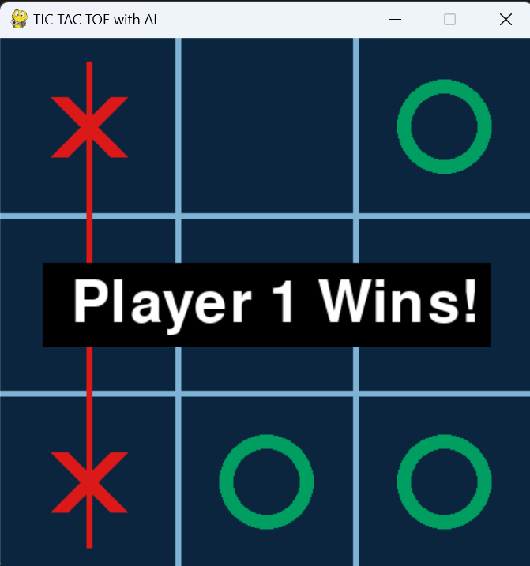
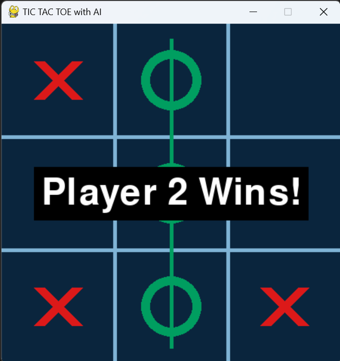
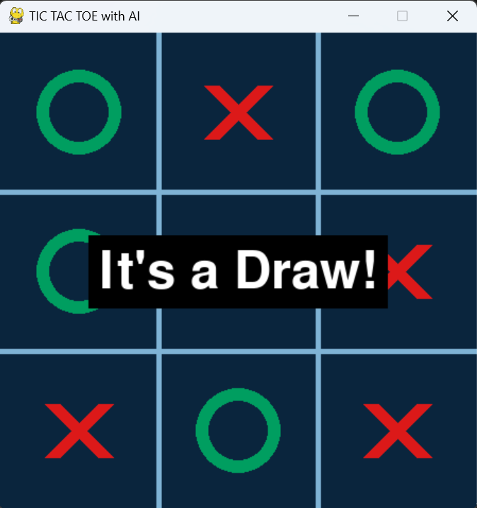

# Tic Tac Tow with AI

This is a Tic Tac Toe game implementation featuring an intelligent AI opponent powered by the Minimax algorithm. The Minimax algorithm allows the AI to strategically evaluate all possible moves and select the one that leads to the most favorable outcome (win or draw).

# Game Instructions :

- press 'R' to restart the game
- press 'M' to change gamemode (pvp or ai)
- press '0' to change ai level to 0 (random)
- press '1' to change ai level to 1 (unbetable)

(First restart and then choose options above)

# Screenshots :

## Start

## Player 1  Wins

## Player 2  Wins

## DRAW

